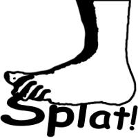

What is Splat?
--------------

   Splat is the sound produced by a stomping bare foot.

The original idea is to apply mathematical concepts to musical composition as
well as sound synthesis.  In practice you can create just about any sound you
can imagine and code in software.  A Splat composition takes the form of a
Python script, and can generate sound data as well as import existing audio
files and run various processing operations.

This does not involve any real-time sound generation, everything runs at its
own pace to ultimately create an audio file which can then be played.  This
makes it possible to run very complicated operations that may take much longer
to create the audio material than it does to play it.  The power of the
computer running the composition will not change the actual audio result; only
the time to generate it will be shorter with a faster machine.

It is usually easier to prototype new tools (i.e. generators, filters ...) in
pure Python, and when some code is known to be working it can be implemented
again in C for improved performance (see ``_splat.c`` in source code
distribution).

Note: Only ``WAV`` audio file format is currently supported.
